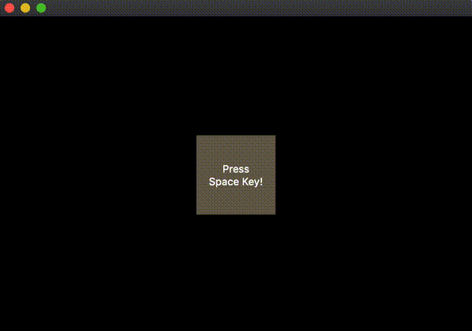

# qt-animated-layout-example

A custom animated layout example in Qt5.

## Notes

- `AnimatedLayout::setGeometry(const QRect&)` manipulates the positions of its child widgets based on delta time (i.e., the elapsed duration from the previous call).
- `AnimatedLayout::update()` will be called in a fixed frame rate (e.g., 60 FPS) by `QTimer`. Note that, as the positions are calculated based on delta time, the frame rate can be varied if necessary without changing the animation itself.
- `AnimatedLayout` can be used with either `QOpenGLWidget` or `QWidget`, but the performance seems to be different. For full screen use, `QOpenGLWidget` is probably more suitable.
